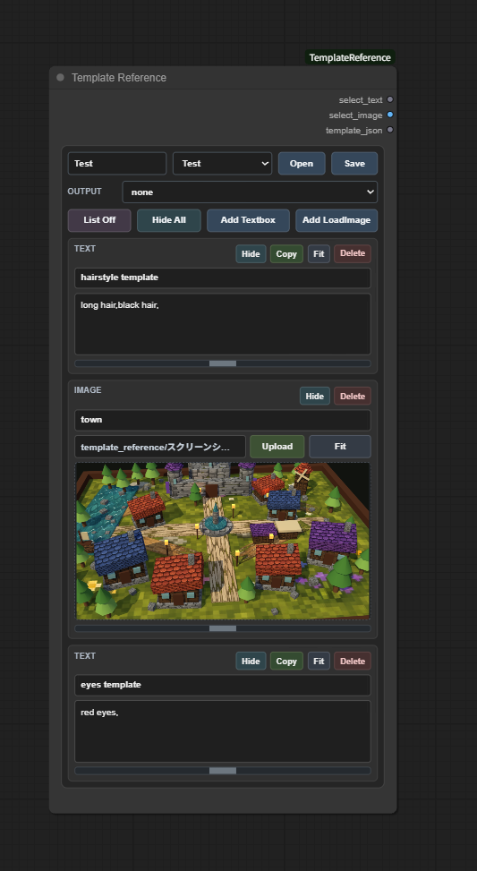
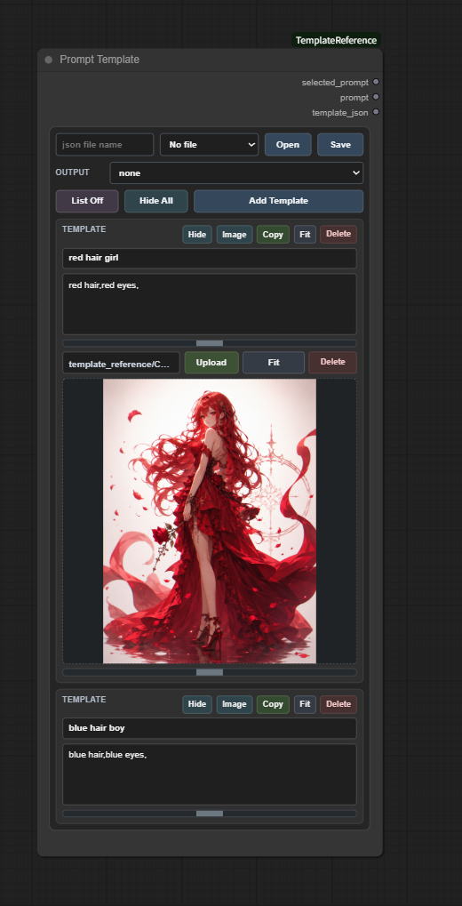

# ComfyUI Template Reference

ComfyUI Template Reference は、ComfyUI 内で再利用可能なテキスト、画像、プロンプトテンプレートのライブラリを作成するためのカスタムノードを 2 つ追加します。

## 機能

- 編集可能なテキスト参照ブロックを作成できます。
- 画像参照ブロックをアップロードしてプレビューできます。
- テンプレートライブラリを JSON ファイルとして保存・読み込みできます。
- Output ドロップダウンから特定のブロックを選択できます。
- 選択したテキストまたは画像を、ほかの ComfyUI ノードへ出力できます。
- ブロックをドラッグして並べ替えできます。
- ノード UI 上でブロックの折りたたみ、展開、リサイズ、コピー、削除ができます。
- ユーザーが作成したデータは、拡張機能のインストールフォルダではなく ComfyUI の user ディレクトリに保存されます。

## ノード

### Template Reference



このノードは、テキストと画像の参照をまとめて管理するために使用します。

出力:

- `select_text`: 選択されたテキストブロックのテキスト。
- `select_image`: 選択された画像ブロックの画像。
- `template_json`: ノード状態全体をシリアライズしたもの。

主な操作:

- `Add Textbox`: テキスト参照ブロックを追加します。
- `Add LoadImage`: 画像参照ブロックを追加します。
- `Output`: 出力へ送信するブロックを選択します。
- `Open` / `Save`: Template Reference の JSON ライブラリを読み込み、または保存します。

### Prompt Template



このノードは、再利用可能なプロンプトテンプレートをまとめて管理するために使用します。

出力:

- `selected_prompt`: 選択されたプロンプトブロックのテキスト。
- `prompt`: 同じ選択済みプロンプトテキストです。利便性のための出力です。
- `template_json`: ノード状態全体をシリアライズしたもの。

主な操作:

- `Add Template`: プロンプトテンプレートブロックを追加します。
- `Output`: テキスト出力へ送信するテンプレートを選択します。
- `none`: 空のプロンプトを出力します。
- `Open` / `Save`: Prompt Template の JSON ライブラリを読み込み、または保存します。
- `Image`: 各プロンプトブロックの任意の参照画像エリアを表示または非表示にします。

## インストール

このリポジトリを ComfyUI の `custom_nodes` ディレクトリにクローンします。

```bash
cd ComfyUI/custom_nodes
git clone https://github.com/Tsubasa109/ComfyUI-TemplateReference.git
```

インストール後、ComfyUI を再起動してください。

## 保存場所

この拡張機能は、ComfyUI の user ディレクトリ配下にローカル保存用フォルダを自動作成します。

```text
ComfyUI/user/template_reference/prompt_templates/
ComfyUI/user/template_reference/prompt_templates/images/
ComfyUI/user/template_reference/reference_templates/
ComfyUI/user/template_reference/reference_templates/image/
```

これらのフォルダには、ユーザーが作成した JSON ライブラリと、コピーされた参照画像が保存されます。


## 注意事項

- 参照画像は JSON ファイル内に埋め込まれません。JSON には画像のメタデータが保存され、拡張機能がアップロード画像を保存フォルダへコピーします。
- 保存済み画像が見つからない場合でも、ノードはワークフローを継続し、小さなプレースホルダー画像を返しながら警告をログに記録します。
- 実行時に使用される保存フォルダは Git の管理対象外であり、リポジトリにコミットしないでください。

## ファイル形式

- すべての JSON テンプレートファイルは UTF-8、BOM なしで保存されます。
- 日本語を含む非 ASCII 文字は、エスケープシーケンスではなく、そのまま JSON に保存されます。
- 保存済み JSON ファイルを外部エディタで開く場合は、エディタの文字コードが UTF-8 に設定されていることを確認してください。

## 必要要件

- ComfyUI

## ライセンス

Apache License 2.0 (see LICENSE)
